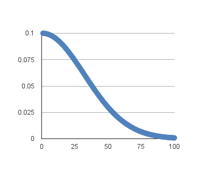
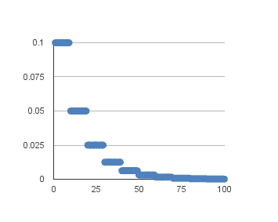

# 在 Python 和 Keras 中对深度学习模型使用学习率调度

> 原文： [https://machinelearningmastery.com/using-learning-rate-schedules-deep-learning-models-python-keras/](https://machinelearningmastery.com/using-learning-rate-schedules-deep-learning-models-python-keras/)

训练神经网络或大型深度学习模型是一项困难的优化任务。

训练神经网络的经典算法称为[随机梯度下降](http://machinelearningmastery.com/gradient-descent-for-machine-learning/)。已经确定，通过使用在训练期间发生变化的学习率，您可以在某些问题上实现更高的表现和更快的训练。

在这篇文章中，您将了解如何使用 Keras 深度学习库在 Python 中为神经网络模型使用不同的学习率调度。

阅读这篇文章后你会知道：

*   如何配置和评估基于时间的学习率调度。
*   如何配置和评估基于丢弃的学习率调度。

让我们开始吧。

*   **2017 年 3 月更新**：更新了 Keras 2.0.2，TensorFlow 1.0.1 和 Theano 0.9.0 的示例。


使用 Keras
在 Python 中使用深度学习模型的学习率调度[哥伦比亚 GSAPP](https://www.flickr.com/photos/gsapponline/17050523800/) ，保留一些权利。

## 训练模型的学习率表

调整随机梯度下降优化程序的学习率可以提高表现并缩短训练时间。

有时这称为学习率退火或自适应学习率。在这里，我们将此方法称为学习率调度，默认计划是使用恒定学习率来更新每个训练时期的网络权重。

在训练期间最简单且可能最常用的学习率调整是随时间降低学习率的技术。当使用较大的学习率值时，这些具有在训练过程开始时进行大的改变的益处，并且降低学习率，使得在训练过程中稍后对权重进行较小的速率并因此进行较小的训练更新。

这具有早期快速学习良好权重并稍后对其进行微调的效果。

两个流行且易于使用的学习率表如下：

*   根据时代逐渐降低学习率。
*   在特定时期使用间断大滴，降低学习率。

接下来，我们将看看如何使用 Keras 依次使用这些学习率调度。

## 基于时间的学习费率表

Keras 内置了基于时间的学习率调度。

SGD 类中的随机梯度下降优化算法实现具有称为衰减的参数。该参数用于基于时间的学习率衰减调度方程如下：

```py
LearningRate = LearningRate * 1/(1 + decay * epoch)
```

当衰减参数为零（默认值）时，这对学习率没有影响。

```py
LearningRate = 0.1 * 1/(1 + 0.0 * 1)
LearningRate = 0.1
```

当指定衰减参数时，它将使学习率从前一个迭代减少给定的固定量。

例如，如果我们使用 0.1 的初始学习率值和 0.001 的衰减，前 5 个时期将调整学习率如下：

```py
Epoch	Learning Rate
1	0.1
2	0.0999000999
3	0.0997006985
4	0.09940249103
5	0.09900646517
```

将其延伸到 100 个时期将产生以下学习率（y 轴）与时期（x 轴）的关系图：



基于时间的学习费率表

您可以通过设置衰减值来创建一个不错的默认计划，如下所示：

```py
Decay = LearningRate / Epochs
Decay = 0.1 / 100
Decay = 0.001
```

以下示例演示了在 Keras 中使用基于时间的学习率适应计划。

它在[电离层二元分类问题](http://archive.ics.uci.edu/ml/datasets/Ionosphere)上得到证实。这是一个小型数据集，您可以从 UCI 机器学习库下载[。使用文件名 ionosphere.csv 将数据文件放在工作目录中。](http://archive.ics.uci.edu/ml/machine-learning-databases/ionosphere/ionosphere.data)

电离层数据集适用于使用神经网络进行实践，因为所有输入值都是相同比例的小数值。

构建一个小型神经网络模型，其中一个隐藏层具有 34 个神经元并使用整流器激活函数。输出层具有单个神经元并使用 S 形激活函数以输出类似概率的值。

随机梯度下降的学习率已设定为 0.1 的较高值。模型训练 50 个时期，衰减参数设置为 0.002，计算为 0.1 / 50。此外，在使用自适应学习率时使用动量可能是个好主意。在这种情况下，我们使用动量值 0.8。

下面列出了完整的示例。

```py
# Time Based Learning Rate Decay
from pandas import read_csv
import numpy
from keras.models import Sequential
from keras.layers import Dense
from keras.optimizers import SGD
from sklearn.preprocessing import LabelEncoder
# fix random seed for reproducibility
seed = 7
numpy.random.seed(seed)
# load dataset
dataframe = read_csv("ionosphere.csv", header=None)
dataset = dataframe.values
# split into input (X) and output (Y) variables
X = dataset[:,0:34].astype(float)
Y = dataset[:,34]
# encode class values as integers
encoder = LabelEncoder()
encoder.fit(Y)
Y = encoder.transform(Y)
# create model
model = Sequential()
model.add(Dense(34, input_dim=34, kernel_initializer='normal', activation='relu'))
model.add(Dense(1, kernel_initializer='normal', activation='sigmoid'))
# Compile model
epochs = 50
learning_rate = 0.1
decay_rate = learning_rate / epochs
momentum = 0.8
sgd = SGD(lr=learning_rate, momentum=momentum, decay=decay_rate, nesterov=False)
model.compile(loss='binary_crossentropy', optimizer=sgd, metrics=['accuracy'])
# Fit the model
model.fit(X, Y, validation_split=0.33, epochs=epochs, batch_size=28, verbose=2)
```

该模型在 67％的数据集上进行训练，并使用 33％的验证数据集进行评估。

运行该示例显示分类准确度为 99.14％。如果没有学习率下降或动量，这高于 95.69％的基线。

```py
...
Epoch 45/50
0s - loss: 0.0622 - acc: 0.9830 - val_loss: 0.0929 - val_acc: 0.9914
Epoch 46/50
0s - loss: 0.0695 - acc: 0.9830 - val_loss: 0.0693 - val_acc: 0.9828
Epoch 47/50
0s - loss: 0.0669 - acc: 0.9872 - val_loss: 0.0616 - val_acc: 0.9828
Epoch 48/50
0s - loss: 0.0632 - acc: 0.9830 - val_loss: 0.0824 - val_acc: 0.9914
Epoch 49/50
0s - loss: 0.0590 - acc: 0.9830 - val_loss: 0.0772 - val_acc: 0.9828
Epoch 50/50
0s - loss: 0.0592 - acc: 0.9872 - val_loss: 0.0639 - val_acc: 0.9828
```

## 基于丢弃的学习率调度

与深度学习模型一起使用的另一种流行的学习率调度是在训练期间的特定时间系统地降低学习率。

通常，通过将学习率降低每个固定数量的迭代的一半来实现该方法。例如，我们可能具有 0.1 的初始学习率并且每 10 个时期将其降低 0.5。前 10 个训练时期将使用 0.1 的值，在接下来的 10 个时期中将使用 0.05 的学习率，依此类推。

如果我们将此示例的学习率绘制到 100 个时期，您将得到下图，显示学习率（y 轴）与时期（x 轴）。



基于丢弃的学习率调度

在拟合模型时，我们可以使用 [LearningRateScheduler](http://keras.io/callbacks/) 回调在 Keras 中实现此功能。

LearningRateScheduler 回调允许我们定义一个调用函数，该函数将迭代号作为参数，并返回用于随机梯度下降的学习率。使用时，忽略随机梯度下降指定的学习率。

在下面的代码中，我们在 Ionosphere 数据集上的单个隐藏层网络之前使用相同的示例。定义了一个新的 step_decay（）函数来实现等式：

```py
LearningRate = InitialLearningRate * DropRate^floor(Epoch / EpochDrop)
```

其中，InitialLearningRate 是初始学习率，例如 0.1，DropRate 是每次更改学习率时修改的量，例如 0.5，Epoch 是当前的迭代号，EpochDrop 是改变学习率的频率，例如 10 。

请注意，我们将 SGD 类中的学习率设置为 0，以清楚地表明它未被使用。不过，如果您想在此学习率调度中使用动量，则可以设置新元的动量项。

```py
# Drop-Based Learning Rate Decay
import pandas
from pandas import read_csv
import numpy
import math
from keras.models import Sequential
from keras.layers import Dense
from keras.optimizers import SGD
from sklearn.preprocessing import LabelEncoder
from keras.callbacks import LearningRateScheduler

# learning rate schedule
def step_decay(epoch):
	initial_lrate = 0.1
	drop = 0.5
	epochs_drop = 10.0
	lrate = initial_lrate * math.pow(drop, math.floor((1+epoch)/epochs_drop))
	return lrate

# fix random seed for reproducibility
seed = 7
numpy.random.seed(seed)
# load dataset
dataframe = read_csv("ionosphere.csv", header=None)
dataset = dataframe.values
# split into input (X) and output (Y) variables
X = dataset[:,0:34].astype(float)
Y = dataset[:,34]
# encode class values as integers
encoder = LabelEncoder()
encoder.fit(Y)
Y = encoder.transform(Y)
# create model
model = Sequential()
model.add(Dense(34, input_dim=34, kernel_initializer='normal', activation='relu'))
model.add(Dense(1, kernel_initializer='normal', activation='sigmoid'))
# Compile model
sgd = SGD(lr=0.0, momentum=0.9, decay=0.0, nesterov=False)
model.compile(loss='binary_crossentropy', optimizer=sgd, metrics=['accuracy'])
# learning schedule callback
lrate = LearningRateScheduler(step_decay)
callbacks_list = [lrate]
# Fit the model
model.fit(X, Y, validation_split=0.33, epochs=50, batch_size=28, callbacks=callbacks_list, verbose=2)
```

运行该示例会导致验证数据集的分类准确率达到 99.14％，这也是问题模型基线的改进。

```py
...
Epoch 45/50
0s - loss: 0.0546 - acc: 0.9830 - val_loss: 0.0634 - val_acc: 0.9914
Epoch 46/50
0s - loss: 0.0544 - acc: 0.9872 - val_loss: 0.0638 - val_acc: 0.9914
Epoch 47/50
0s - loss: 0.0553 - acc: 0.9872 - val_loss: 0.0696 - val_acc: 0.9914
Epoch 48/50
0s - loss: 0.0537 - acc: 0.9872 - val_loss: 0.0675 - val_acc: 0.9914
Epoch 49/50
0s - loss: 0.0537 - acc: 0.9872 - val_loss: 0.0636 - val_acc: 0.9914
Epoch 50/50
0s - loss: 0.0534 - acc: 0.9872 - val_loss: 0.0679 - val_acc: 0.9914
```

## 使用学习率调度的提示

本节列出了在使用神经网络学习率调度时要考虑的一些提示和技巧。

*   **提高初始学习率**。因为学习率很可能会降低，所以从较大的值开始减少。较大的学习率将导致权重的更大变化，至少在开始时，允许您稍后从微调中受益。
*   **使用大动量**。当您的学习率缩小到较小值时，使用较大的动量值将有助于优化算法继续在正确的方向上进行更新。
*   **尝试不同的时间表**。目前还不清楚使用哪种学习率调度，因此请尝试使用不同的配置选项，看看哪种方法最适合您的问题。还可以尝试以指数方式更改的计划，甚至可以计划响应模型在训练或测试数据集上的准确性的计划。

## 摘要

在这篇文章中，您发现了用于训练神经网络模型的学习率调度。

阅读这篇文章后，您了解到：

*   如何在 Keras 中配置和使用基于时间的学习费率表。
*   如何在 Keras 开发自己的基于 drop 的学习率调度。

您对神经网络或此帖子的学习率表有任何疑问吗？在评论中提出您的问题，我会尽力回答。